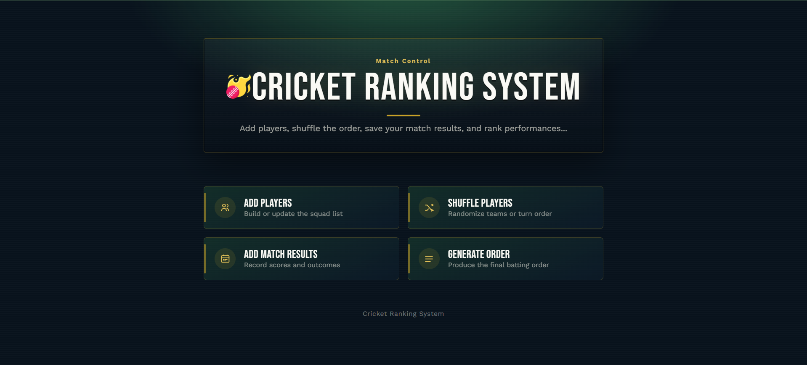
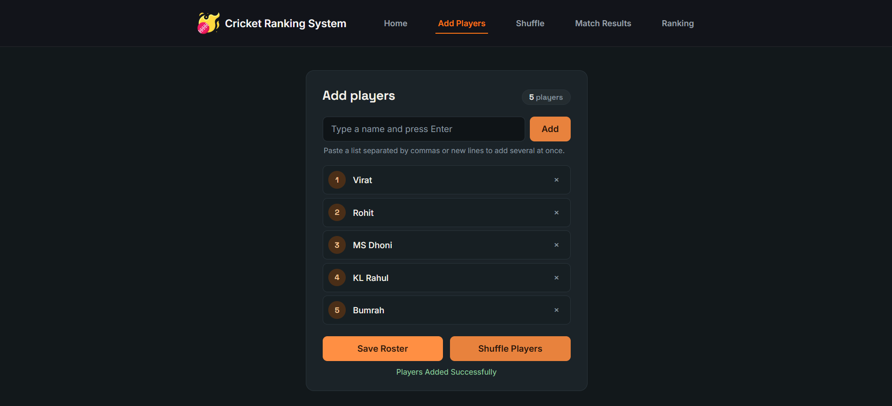
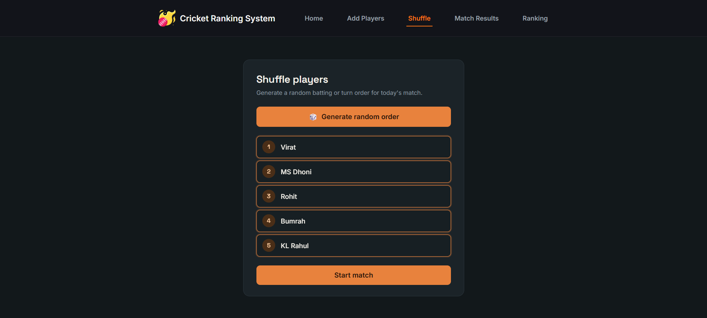
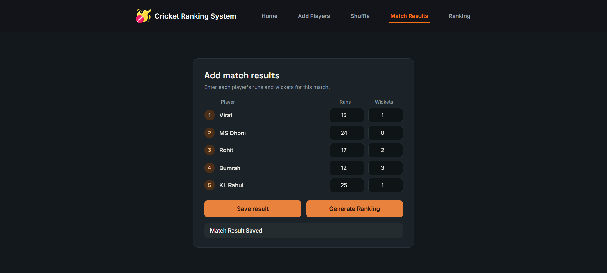
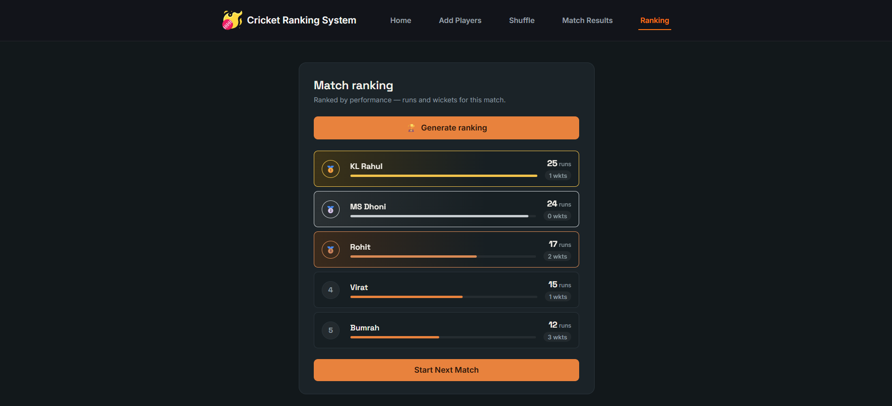

#  Cricket Ranking System

## Overview

Cricket Ranking System is a web-based application developed to automate player ranking and match management for cricket sessions.
The system eliminates manual ranking calculations by generating player rankings based on their match performance (runs and wickets). It provides a simple workflow for managing players, recording match results, and generating rankings after each match.

---

## Features

### Player Management
- Add multiple players
- Prevent duplicate player entries
- Remove players from roster

### Random Match Order Generation
- Generate a random player order before the first match
- Display shuffled player sequence

### Match Result Management
- Enter runs scored by each player
- Enter wickets taken by each player
- Store match performance data

### Ranking Generation
- Generate rankings based on player performance
- Sort players according to calculated score
- Display rankings in descending order

### Session Handling
- Start a new session with a new set of players
- Clear previous session data automatically

---

## Technologies Used

### Backend
- Java
- Spring Boot
- REST API
- Maven

### Frontend
- HTML5
- CSS3
- JavaScript

### Tools
- IntelliJ IDEA
- VS Code
- Postman
- Git
- GitHub

---

## Project Workflow

```text
  Add Players
      ↓
Generate Random Order
      ↓
  Start Match
      ↓
Add Match Results
      ↓
Generate Ranking
      ↓
  Next Match 
```

---

## Ranking Formula

Current ranking score:

```text
Score = Runs + (Wickets × 0.5)
```

Players are ranked in descending order based on their score.

---

## REST API Endpoints

### Add Players

```http
POST /cric/add
```

Request:

```json
{
  "players": [
    "Virat",
    "Rohit",
    "MS Dhoni"
  ]
}
```

---

### Generate Random Order

```http
GET /cric/shuffle
```

---

### Save Match Result

```http
POST /cric/result
```

Request:

```json
[
  {
    "name": "Virat",
    "runs": 50,
    "wickets": 2
  },
  {
    "name": "Rohit",
    "runs": 40,
    "wickets": 1
  }
]
```

---

### Generate Ranking

```http
GET /cric/generateOrder
```

---

## Project Structure

```text
cricket-ranking-system
│
├── src/main/java
│   ├── controller
│   ├── service
│   ├── dto
│   ├── entity
│   └── repository
│
├── cricket-ranking-system-frontend
│   ├── pages
│   ├── css
│   ├── js
│   └── assets
│
└── pom.xml
```

---

## Screenshots

### Home



### Add Players



### Shuffle Players



### Match Results



### Generate Ranking



---

## Future Enhancements

- Store player statistics in a database
- Multi-match session tracking
- Player performance history
- Average score calculation
- Authentication and user management
- Cloud deployment

---

## Author

**Abraar Ahamed**

GitHub:
https://github.com/Abraar123
